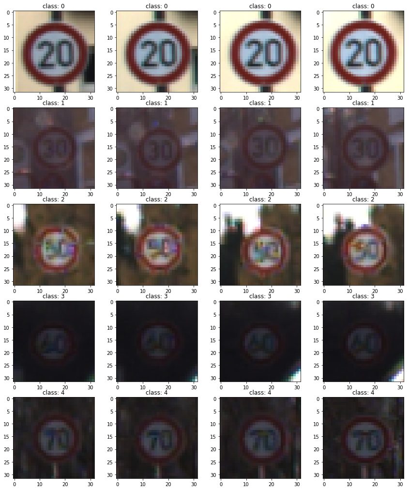
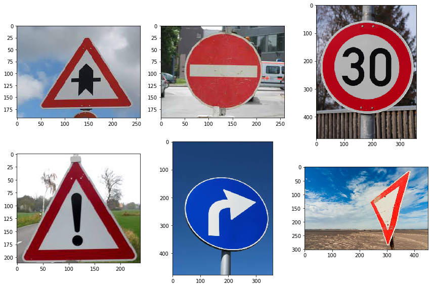
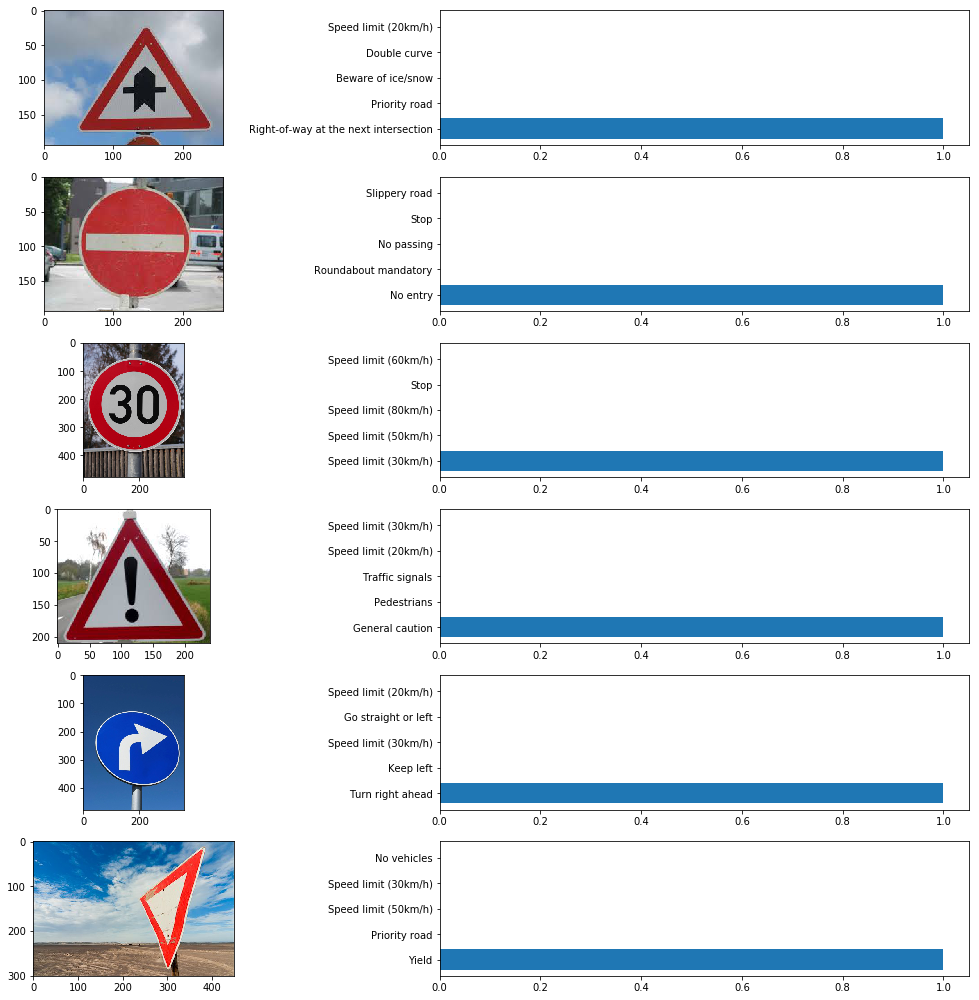

## Project: Build a Traffic Sign Recognition Program
[](http://www.udacity.com/drive)

In this project, you will use what you've learned about deep neural networks and convolutional neural networks to classify traffic signs. You will train and validate a model so it can classify traffic sign images using the [German Traffic Sign Dataset](http://benchmark.ini.rub.de/?section=gtsrb&subsection=dataset). After the model is trained, you will then try out your model on images of German traffic signs that you find on the web.

The goals / steps of this project are the following:
* Load the data set
* Explore, summarize and visualize the data set
* Design, train and test a model architecture
* Use the model to make predictions on new images
* Analyze the softmax probabilities of the new images
* Summarize the results with a written report

## Writeup
All the code related to this project located in this [jupyter notebook](https://github.com/samuelpfchoi/CarND-P2-Traffic-Sign-Classifier-Project/blob/master/Traffic_Sign_Classifier.ipynb)

### Data Set Summary & Exploration

**Data Set**

[German Traffic Sign Dataset](http://benchmark.ini.rub.de/?section=gtsrb&subsection=dataset) is used. This is a pickled dataset in which the images have already been resized to 32x32. It contains a training, validation and test set. Their data size are:

* The size of training set is 34799
* The size of the validation set is 4410
* The size of test set is 12630
* The shape of a traffic sign image is (32, 32, 3)
* The number of unique classes/labels in the data set is 43

Here is some sample images of the training data set:




### Design and Test a Model Architecture

**Pre-processing**

As a first step, the training images were converted to grayscale because it is earier way to acheive color invariance. Then, normalizing the image data.

**Model Architecture**

My final model uses LeNet architecture, which is consisted of the following layers:

| Layer         		|     Description	        					| 
|:---------------------:|:---------------------------------------------:| 
| Input         		| 32x32x1 Gray image   							| 
| Convolution 5x5		| 1x1 stride, same padding, outputs 28x28x6 	|
| RELU					|												|
| Max pooling	      	| 2x2 stride,  outputs 14x14x6  				|
| Convolution 5x5	    | 1x1 stride, same padding, outputs 10x10x16 	|
| RELU					|												|
| Max pooling	      	| 2x2 stride,  outputs 5x5x6  					|
| Flatten				| Inputs 5x5x16, Outputs 400  					|
| Fully connected		| Inputs 400, Outputs 120						|
| RELU					|												|
| Fully connected		| Inputs 120, Outputs 84						|
| RELU					|												|
| Fully connected		| Inputs 84, Outputs 43							|
| RELU					|												|


the following hyperparameters are used:
```
EPOCHS = 100 
BATCH_SIZE = 400
rate = 0.004
```

My final model results were:
* training set accuracy of 1.0
* validation set accuracy of 0.944 
* test set accuracy of  0.9218

### Test a Model on New Images

Here are six German traffic signs that I found on the web:



Here are the results of the prediction:

| Image											|     Prediction								| 
|:---------------------------------------------:|:---------------------------------------------:| 
| Right-of-way at the next intersection ( 11 )	| Right-of-way at the next intersection ( 11 )	| 
| No entry ( 17 )								| No entry ( 17 )								|
| Speed limit (30km/h) ( 1 )					| Speed limit (30km/h) ( 1 )					|
| General caution ( 18 )						| General caution ( 18 )						|
| Turn right ahead ( 33 )						| Turn right ahead ( 33 )						|
| Yield ( 13 )									| Yield ( 13 )									|

The model was able to correctly guess 6 of the 6 traffic signs, which gives an accuracy of 100%. This compares favorably to the accuracy on the test set as these images are clear with good contrast.

In additional, the following shown the top 5 softmax probabilities for each image along with the sign type of each probaility:




